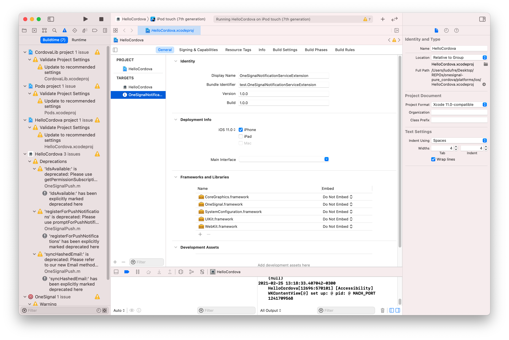
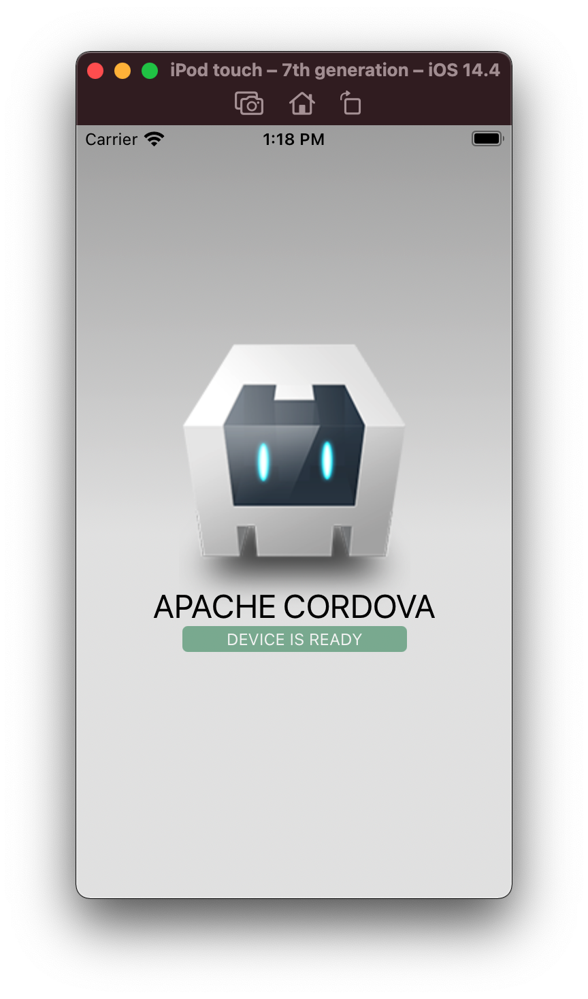

# onesignal-pure-cordova
Test repo with hook I've created to auto add Notifications Service with OneSignal: https://github.com/OneSignal/OneSignal-Cordova-SDK/pull/688

Commands:

```bash
ludufre@iMac-de-Luan REPOs % cordova create onesignal-pure_cordova test
Creating a new cordova project.

ludufre@iMac-de-Luan REPOs % cd onesignal-pure_cordova

ludufre@iMac-de-Luan onesignal-pure_cordova % npm i
npm notice created a lockfile as package-lock.json. You should commit this file.
npm WARN test@1.0.0 No repository field.
added 1 package from 1 contributor and audited 1 package in 1.086s
found 0 vulnerabilities

ludufre@iMac-de-Luan onesignal-pure_cordova % cordova platform add ios
Using cordova-fetch for cordova-ios@^6.1.0
Adding ios project...
Creating Cordova project for the iOS platform:
	Path: platforms/ios
	Package: test
	Name: HelloCordova
iOS project created with cordova-ios@6.2.0
Discovered plugin "cordova-plugin-whitelist". Adding it to the project
Installing "cordova-plugin-whitelist" for ios
Adding cordova-plugin-whitelist to package.json

ludufre@iMac-de-Luan onesignal-pure_cordova % touch .gitignore

ludufre@iMac-de-Luan onesignal-pure_cordova % echo "node_modules/" >> .gitignore 

ludufre@iMac-de-Luan onesignal-pure_cordova % git init
Initialized empty Git repository in /Users/ludufre/Desktop/REPOs/onesignal-pure_cordova/.git/

ludufre@iMac-de-Luan onesignal-pure_cordova % git add .

ludufre@iMac-de-Luan onesignal-pure_cordova % git commit -m "Fresh"
[master (root-commit) 7d5c547] Fresh
 8 files changed, 953 insertions(+)
 create mode 100644 .gitignore
 create mode 100644 config.xml
 create mode 100644 package-lock.json
 create mode 100644 package.json
 create mode 100644 www/css/index.css
 create mode 100644 www/img/logo.png
 create mode 100644 www/index.html
 create mode 100644 www/js/index.js
 
ludufre@iMac-de-Luan onesignal-pure_cordova % cordova plugin add https://github.com/ludufre/OneSignal-Cordova-SDK.git 
Installing "onesignal-cordova-plugin" for ios
"framework" tag with type "podspec" is deprecated and will be removed. Please use the "podspec" tag.
Running command: pod install --verbose
Adding onesignal-cordova-plugin to package.json
	[OneSignal - Notification Service Extension] Installation start
	[OneSignal - Notification Service Extension] Append PBXBuildFile section
	[OneSignal - Notification Service Extension] Append PBXContainerItemProxy section
	[OneSignal - Notification Service Extension] Append PBXCopyFilesBuildPhase section
	[OneSignal - Notification Service Extension] Append PBXFileReference section
	[OneSignal - Notification Service Extension] Append PBXFrameworksBuildPhase section
	[OneSignal - Notification Service Extension] Append PBXGroup section > Products > children
	[OneSignal - Notification Service Extension] Append PBXGroup section > CustomTemplate > children
	[OneSignal - Notification Service Extension] Append PBXGroup section > Frameworks > children
	[OneSignal - Notification Service Extension] Append PBXGroup section
	[OneSignal - Notification Service Extension] Append PBXNativeTarget section > AppName > buildPhases & dependencies
	[OneSignal - Notification Service Extension] Append PBXNativeTarget section
	[OneSignal - Notification Service Extension] Append PBXProject section > AppName > attributes & targets
	[OneSignal - Notification Service Extension] Append PBXNativeTarget section
	[OneSignal - Notification Service Extension] Append PBXSourcesBuildPhase section
	[OneSignal - Notification Service Extension] Append PBXTargetDependency section
	[OneSignal - Notification Service Extension] Append XCBuildConfiguration section
	[OneSignal - Notification Service Extension] Append XCConfigurationList section
	[OneSignal - Notification Service Extension] Source files and Frameworks installed
	[OneSignal - Notification Service Extension] App Group created for Entitlements-Release.plist
	[OneSignal - Notification Service Extension] App Group created for Entitlements-Debug.plist
	[OneSignal - Notification Service Extension] Folder OneSignalNotificationServiceExtension created
	[OneSignal - Notification Service Extension] File Info.plist created
	[OneSignal - Notification Service Extension] File NotificationService.h created
	[OneSignal - Notification Service Extension] File NotificationService.m created
	[OneSignal - Notification Service Extension] Installation finished

ludufre@iMac-de-Luan onesignal-pure_cordova % git add .

ludufre@iMac-de-Luan onesignal-pure_cordova % git commit -m "After install OneSignal"
[master 736d335] After install OneSignal
 2 files changed, 9 insertions(+), 2 deletions(-)

ludufre@iMac-de-Luan onesignal-pure_cordova % git remote add origin git@github.com:ludufre/onesignal-pure-cordova.git

ludufre@iMac-de-Luan onesignal-pure_cordova % git branch -M main

ludufre@iMac-de-Luan onesignal-pure_cordova % git push -u origin main

Warning: Permanently added the RSA host key for IP address '140.82.112.4' to the list of known hosts.
Enumerating objects: 18, done.
Counting objects: 100% (18/18), done.
Delta compression using up to 12 threads
Compressing objects: 100% (15/15), done.
Writing objects: 100% (18/18), 33.83 KiB | 16.92 MiB/s, done.
Total 18 (delta 4), reused 0 (delta 0)
remote: Resolving deltas: 100% (4/4), done.
To github.com:ludufre/onesignal-pure-cordova.git
 * [new branch]      main -> main
Branch 'main' set up to track remote branch 'main' from 'origin'.

```



